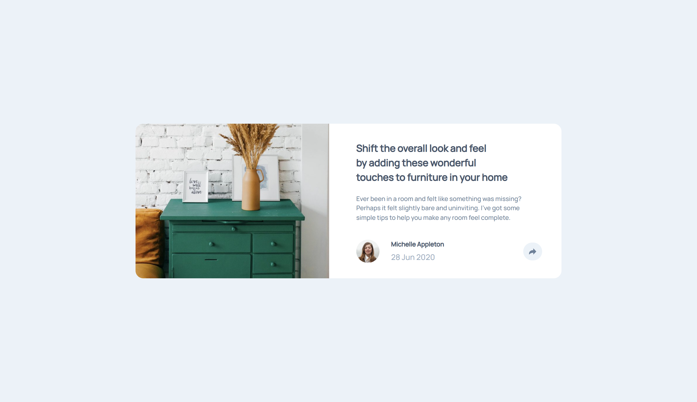
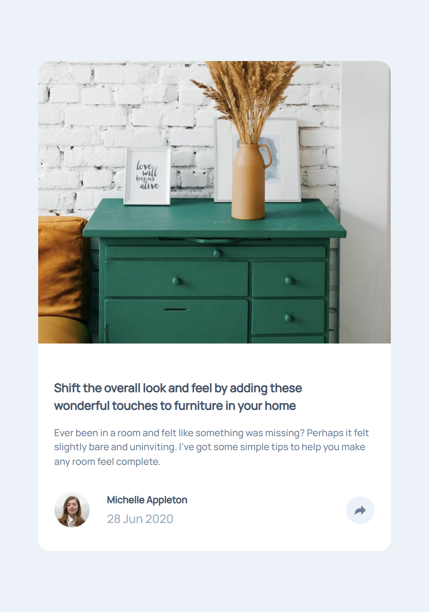
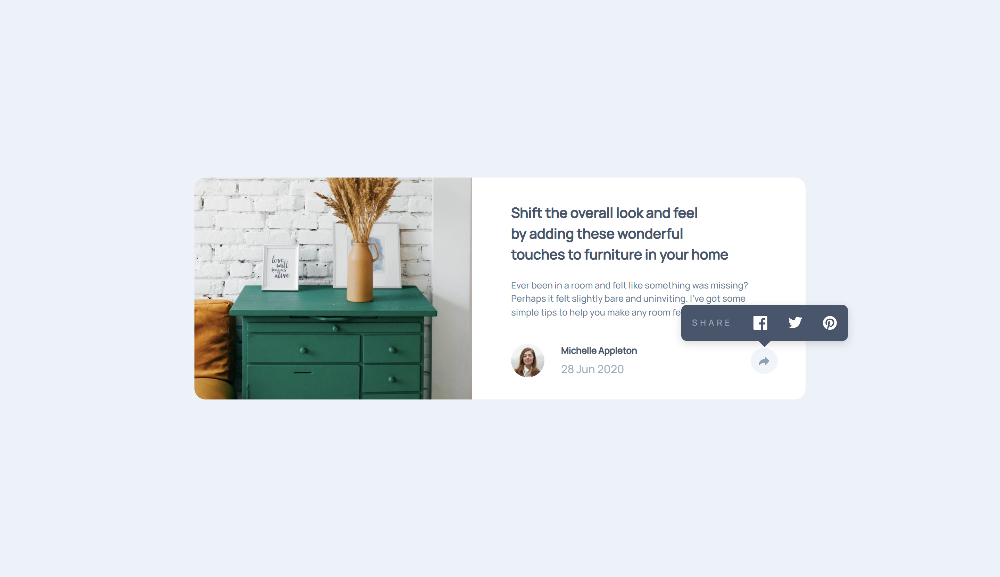
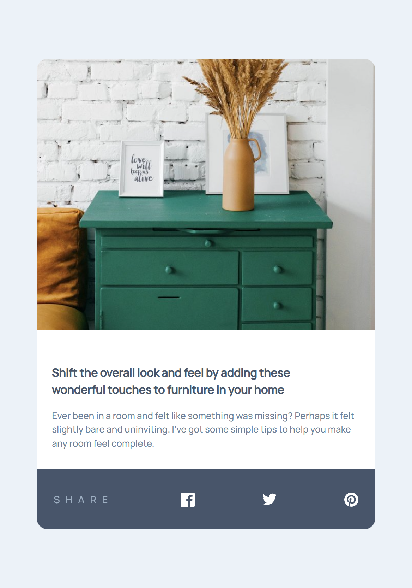

# Frontend Mentor - Article preview component

This is a solution to the [Article preview component on Frontend Mentor](https://www.frontendmentor.io/challenges/article-preview-component-dYBN_pYFT). Frontend Mentor challenges help you improve your coding skills by building realistic projects.

## Table of contents

- [Overview](#overview)
  - [The challenge](#the-challenge)
  - [Screenshot](#screenshot)
  - [Links](#links)
- [My process](#my-process)
  - [Built with](#built-with)
  - [What I learned](#what-i-learned)
  - [Useful resources](#useful-resources)
- [Author](#author)

## Overview

### The challenge

Users should be able to:

- See the social media share links when they click the share icon
- View the optimal layout for each page depending on their device's screen size
- See hover states for all interactive elements on the page

### Screenshot

| Desktop View                  | Mobile View                  |
| ----------------------------- | ---------------------------- |
|  |  |

| Desktop View Tooltip Open          | Mobile View Tooltip Open          |
| ---------------------------------- | --------------------------------- |
|  |  |

### Links

[Live Site URL](https://kapteynuniverse.github.io/Article-preview-component/)

[Solution URL](https://www.frontendmentor.io/solutions/article-preview-nY6lnxQSHo)

## My process

### Built with

- Semantic HTML5 markup
- CSS custom properties
- Mobile-first workflow
- Flexbox
- Popover API
- Anchor positioning
- `@starting-style` for smooth popover animations

### What I learned

While building this project, I improved my understanding of:

- How to use the **Popover API** to create interactive UI elements without relying heavily on JavaScript
- How **CSS Anchor Positioning** works and how it can be used to position elements relative to a trigger
- The behavior of the **top layer** when using popovers and how it affects layout and pseudo-elements
- Creating a tooltip-like component using modern CSS instead of traditional positioning hacks

### Useful resources

- [Popover API](https://developer.mozilla.org/en-US/docs/Web/API/Popover_API) : Helped me understand how to build interactive popovers without JavaScript.
- [Anchor positioning](https://developer.mozilla.org/en-US/docs/Web/CSS/Guides/Anchor_positioning) : Useful for positioning elements relative to another element in a modern way.
- [@starting-style](https://developer.mozilla.org/en-US/docs/Web/CSS/Reference/At-rules/@starting-style) : Helped to create smooth entry animations for the popover.
- [Stop using JS for managing modals!](https://www.youtube.com/watch?v=DXdGzNyV030) : Great explanation of Popover API.

## Author

- Frontend Mentor - [Asilcan Toper](https://www.frontendmentor.io/profile/KapteynUniverse)
